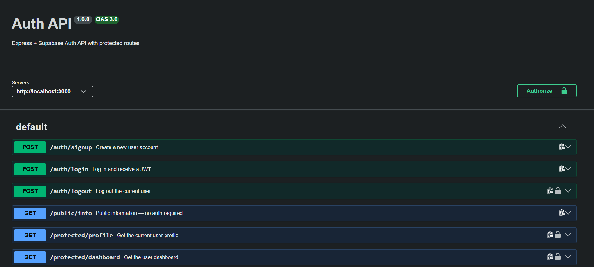

# Auth API — Express + Supabase

A secure REST API build using Express and Supabase. It handles signup, login, signout. It uses JWT verification issued from Supabase, and protects private routes via reusable authentication middleware. It uses swagger for it's interactive Documentation

This Project uses Supabase as authentication provider, hasing the password and providing token for user authentication. The server never touches credentials directly

## Features

- **Sign up** — create a new user account via Supabase Auth
- **Log in** — authenticate and receive a JWT access token + refresh token
- **sign out** — end the user session (protected route)
- **Public route** — no authentication required
    - **info**   
- **Protected routes** — require a valid bearer token, verified against Supabase
    - **profile** 
    - **dashboard**  
- **Reusable middleware** — one `requireAuth` function guards every protected route
- **Swagger UI** — interactive docs with a padlock "Authorize" button for pasting a JWT
- **ESM** — project uses ES modules (`"type": "module"`)

## Prerequisites

- **Node.js 20+**
- A free **Supabase** project ([supabase.com](https://supabase.com))

## Setup

### 1. Clone and install

```bash
git clone https://github.com/Astronova1/Flyrank_ai_asg.git
cd BE03
npm install
```

### 2. Create a Supabase project

1. Sign in at [supabase.com](https://supabase.com) and create a new project.
2. Go to **Project Settings → API** and copy:
   - **Project URL** (looks like `https://xxxxx.supabase.co`)
   - **Publishable key** (starts with `sb_publishable_...`) the replacement for the legacy `anon` key.

### 3. Configure environment variables

Copy the template and fill in your values:

```bash
cp .env.example .env
```
`.env`:

```env
SUPABASE_URL=https://your-project.supabase.co
SUPABASE_KEY=sb_publishable_your_key_here
PORT=3000
```

## Run the Server

```bash
npm start
##or 
node ./server.js
```

## Swagger and API Base URL
- API base: `http://localhost:3000`
- Interactive docs: `http://localhost:3000/docs`

## API reference

| Method | Endpoint              | Auth required | Description                                         |
|--------|-----------------------|:-------------:|-----------------------------------------------------|
| POST   | `/auth/signup`        | No            | Create a new user account                           |
| POST   | `/auth/login`         | No            | Authenticate and receive JWT + refresh token        |
| POST   | `/auth/signout`       | Yes           | End the current user session (204 on success)       |
| GET    | `/public/info`        | No            | Public information, open to anyone                  |
| GET    | `/protected/profile`  | Yes           | Get the authenticated user's profile                |
| GET    | `/protected/dashboard`| Yes           | Example protected route reusing the same middleware |

## Screenshot




## Tech stack

- **Runtime**: Node.js
- **Framework**: Express 5
- **Identity Provider**: Supabase Auth (`@supabase/supabase-js`)
- **API docs**: `swagger-ui-express` + OpenAPI 3.0
- **Config**: `dotenv`