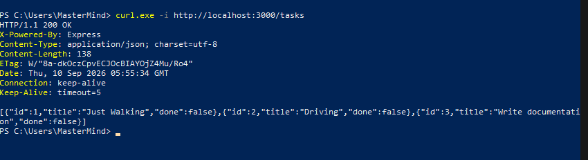
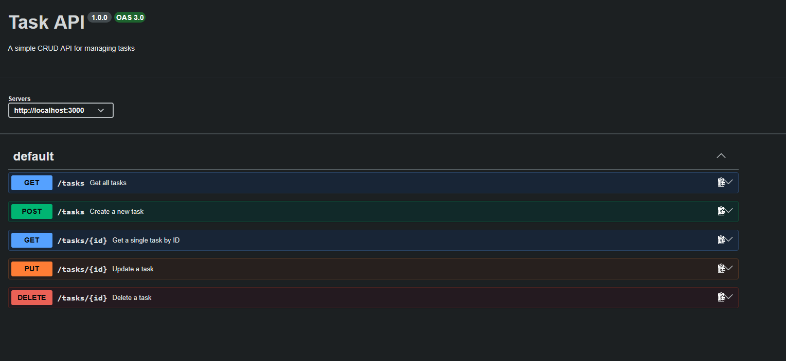
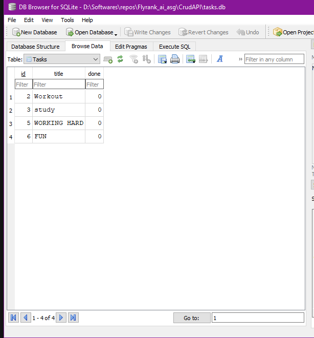
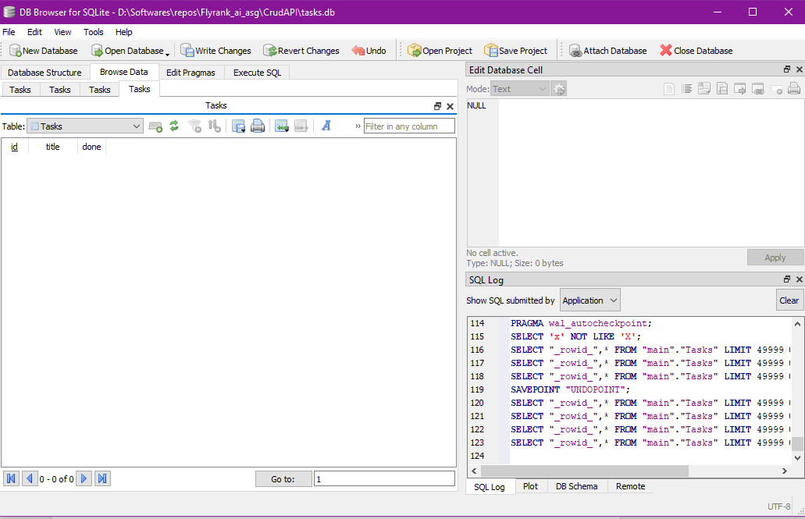
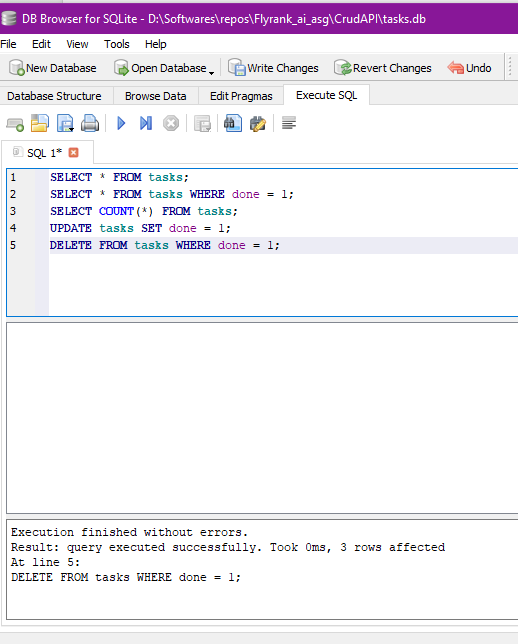

## Install with npm init -y

| Method | Endpoint      | Description                     |
|--------|---------------|---------------------------------|
| GET    | `/health`     | Health check                    |
| GET    | `/tasks`      | List all tasks                  |
| GET    | `/tasks/:id`  | Get one task by ID              |
| POST   | `/tasks`      | Create a new task               |
| PUT    | `/tasks/:id`  | Update a task                   |
| DELETE | `/tasks/:id`  | Delete a task                   |

## ScreenShot Of CURL

## Swagger 

## SQL LITE
Sql lite was chosen because it's lightweight and easy to install and run and the database is a simple and small so any lightweight database can do

The database is store in tasks.db file in the same directory as server.js
Run the project using node ./server.js and the database download using `npm install better-sqlite3` or `npm install -y`

## DB SCREENSHOTS

### WITH DATA

### WITH QUERIES EXECUTED

### AFTER ADDING DATA
