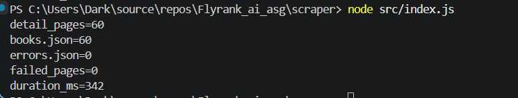

## Target classification

### WHY THIS SITE:
We use 'toscrape.com' because it is a webscraping platform specifically designed for scraping and practicing scraping is what it is designed for without harming 

### HOW MUCH
We only do first three catalogue pages only , that is about 60 books 

### WHAT WE COLLECT
Data about each book (like URL, title, Description, price , fetchedat etc)

This is appropiate here becasue the site is speicifically made for it and it allows it. It is a sanbox made for practicing

**I will not reuse this code on another site without checking its rules and terms first.**


## Target classification

## Lane

JavaScript (Node.js 22+), using:
- Built-in `fetch` for HTTP
- `cheerio` for HTML parsing
- `zod` for schema validation
- Built-in `node:fs/promises` for file I/O

No browser, no paid proxy, no cloud account.

---

## Setup

```bash
npm install
```

That's it. No `.env` file, no API keys, no accounts.

## Run

```bash
npm start
```

Or directly:

```bash
node src/index.js
```

**First run** — takes about 30–60 seconds. It fetches all 63 pages (3 catalogue + 60 books) with a 500ms delay between each network request, caches each page to `cache/`, extracts and validates the data, and writes the output files.

**Reruns** — instant. All 63 pages come from the local cache, so no network requests are made. The output is identical.

## Output

Three files land in `output/`:

| File | Contents |
|---|---|
| `books.json` | 60 validated records |
| `errors.json` | Any records that failed schema validation, with a reason (empty on a clean run) |
| `run-report.json` | Counts, cache hits, failures, and duration for the last run |

And one directory, `cache/`, holds the raw HTML for every fetched page. It is git-ignored — you regenerate it on the first run.

---

## Record schema

Every record in `books.json` has these fields:

| Field | Type | Notes |
|---|---|---|
| `title` | string | Book title |
| `product_url` | string (URL) | Absolute URL of the book page — the record's canonical identity |
| `price_text` | string | Raw price as shown on the page, e.g. `"£51.77"` |
| `price_gbp` | number | Normalized price, e.g. `51.77` |
| `availability_text` | string | e.g. `"In stock (22 available)"` |
| `rating_text` | string | e.g. `"Three"` |
| `description` | string \| null | Null when the page has no description — never invented |
| `source_page` | string (URL) | Which catalogue page the book was discovered on |
| `fetched_at` | string (ISO 8601) | When the page was fetched |

`price_text` is kept alongside `price_gbp` on purpose: the raw value and the clean value live side by side, so a wrong number can always be traced back to what the page actually said.

---

## Politeness rules

- **User-agent:** every request sends `Flyrank internshipt project` — an honest identifier with a contact link.
- **Delay:** at least 500 ms between real network requests. Cached pages have no delay — they never leave the machine.
- **Timeout:** every request gives up after 20 seconds. Never waits forever.
- **Status check:** only HTTP 200 is treated as success. Anything else is a failed fetch, logged and skipped.
- **Cache:** pages are saved to `cache/` under a SHA-256 hash of their URL. Development reads from cache; the site feels each page once.
- **Retry:** transient failures (timeouts, 5xx) get one retry. 4xx is never retried — asking again for a page that does not exist will not create it.

---

## One honest limitation

The extractor assumes the HTML structure of Books to Scrape stays the same. If the site ever changes its class names — for example, if `.product_main` gets renamed — the selector-based extraction returns empty strings and every record fails schema validation. The pipeline would not crash; it would report 0 valid records in `run-report.json` and 60 invalid ones in `errors.json`. Detecting that requires reading the report, not just checking whether the run finished.

---

## Sample run report



```json
{
  "start_time": "2026-09-18T13:08:12.903Z",
  "duration_ms": 342,
  "pages_fetched": 0,
  "cache_hits": 60,
  "valid_records": 60,
  "invalid_records": 0,
  "failed_pages": 0,
  "skipped_urls": []
}```

---

## Why no browser
This assignment needs none of javascripts,images,css etc: the data is already in the HTML the server sends, so a browser would only add cost, memory, time, and complexity without adding any capability.

---

## Ethics

- Prefer an official API when one exists. only scrape when API is not available and no other option.
- Never bypass logins, paywalls, or rate limits. If a site says no, that is the answer.
- Collect only what you need.
- Say who you are. Every request carries a user-agent with a contact link.
- Go slowly. A polite scraper is one the site never notices.

---

## Project structure

```
scraper/
├── src/
│   ├── index.js       # entry: orchestrates the pipeline
│   ├── fetch.js       # fetch with cache, timeout, delay, retry
│   ├── discover.js    # catalogue → 60 unique book URLs
│   ├── extract.js     # book page → 8 raw fields
│   ├── normalize.js   # price_text → price_gbp
│   ├── schema.js      # zod schema for a valid record
│   ├── store.js       # validate + write books.json / errors.json
│   └── report.js      # write run-report.json
├── cache/             # git-ignored — raw HTML
├── output/
│   ├── books.json
│   ├── errors.json
│   └── run-report.json
├── .gitignore
├── package.json
└── README.md
```